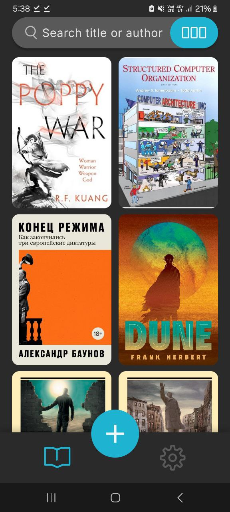
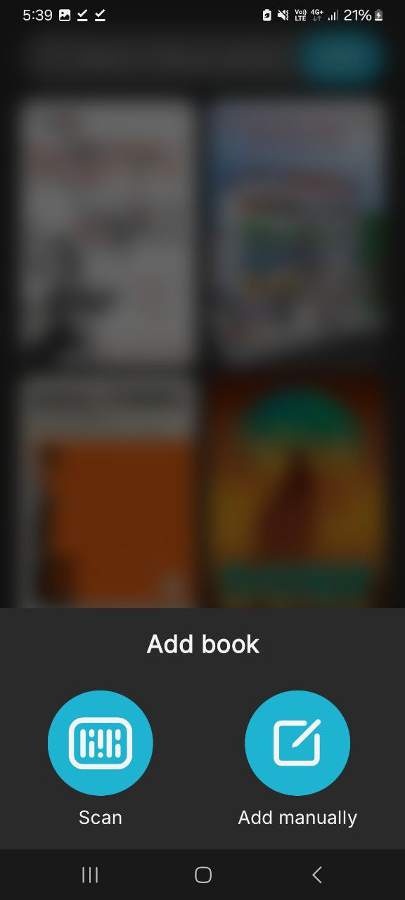
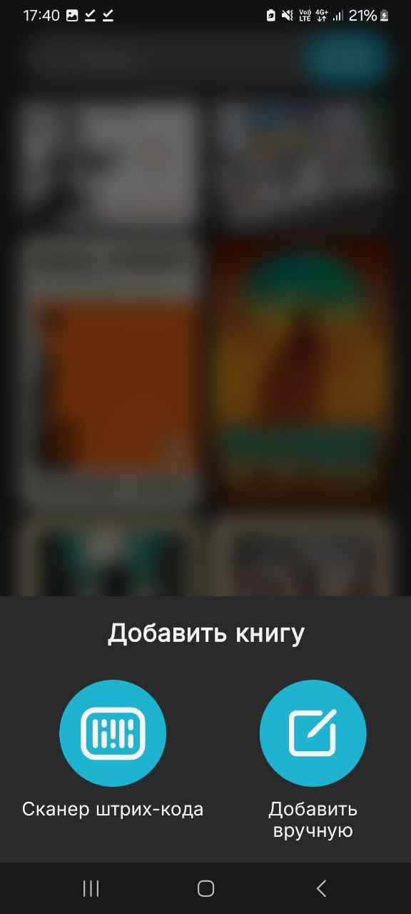

# Libook
A simple and convenient Android app for managing your personal library: add books manually or via an ISBN scanner, rate them, share book cards, and store notes.

## Features
- Add books manually or by scanning an ISBN barcode  
- Edit and delete books  
- Search through your library  
- Rate books across multiple criteria: overall score, characters, expectations, plot  
- Add notes to books  
- Share a book card  
- Support for dark and light themes  
- RU and EN localization support  

## Installation
Download the latest version of the app:  
➡️ [Releases](https://github.com/Resonare/Libook/releases/tag/alpha)

Install the APK on your Android 9+ device.

## Screenshots

  
  
  

## Technologies
- Kotlin  
- Jetpack Compose  
- Room  
- Retrofit  
- ML Kit  

## Report an Issue
Found a bug? Open an Issue:  
➡️ [New Issue](https://github.com/Resonare/Libook/issues)

## Roadmap
- Creating and switching between multiple bookshelves  
- Library import/export  
- Book statuses (reading / completed / planned)  
- Filters and sorting  

# RU Libook
Простое и удобное Android-приложение для ведения личной библиотеки: добавляйте книги вручную или через сканер ISBN, оценивайте их, делитесь карточками книг и храните заметки.

## Возможности
- Добавление книг вручную или сканированием штрих-кода ISBN  
- Редактирование и удаление книг  
- Поиск по библиотеке  
- Оценка книги по критериям: общая оценка, персонажи, ожидания, сюжет  
- Добавление заметок к книгам  
- Возможность делиться карточкой книги  
- Поддержка тёмной и светлой темы  
- Поддержка RU и EN локализаций  

## Установка
Скачайте последнюю версию приложения:
➡️ [Releases](https://github.com/Resonare/Libook/releases/tag/alpha)

Установите APK на своё устройство Android 9+.

## Скриншоты

  
  
  

## Технологии
- Kotlin  
- Jetpack Compose  
- Room  
- Retrofit  
- ML Kit  

## Сообщить об ошибке
Нашли баг? Создайте Issue:  
➡️ [New Issue](https://github.com/Resonare/Libook/issues)

## Планы
- Создание и переключение между полками книг  
- Импорт/экспорт библиотеки  
- Статусы книги (читаю / читал / в планах)  
- Фильтры и сортировка
